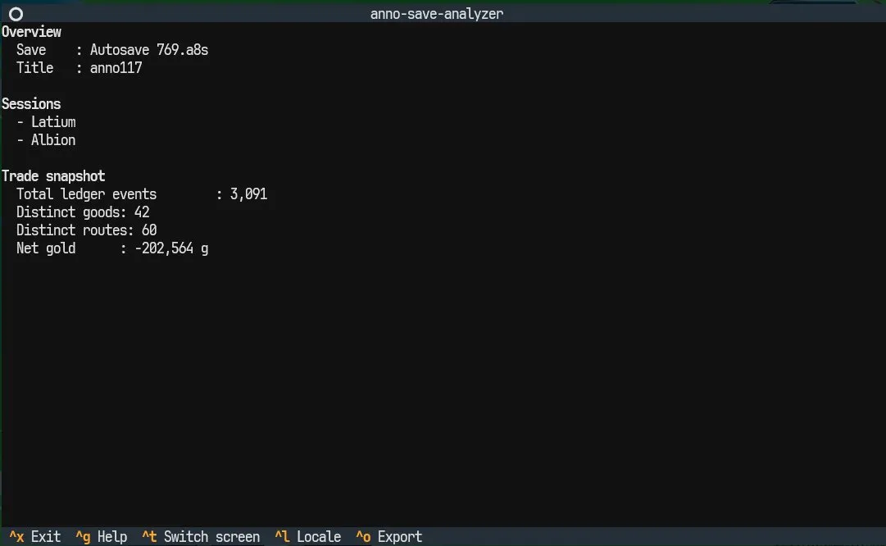
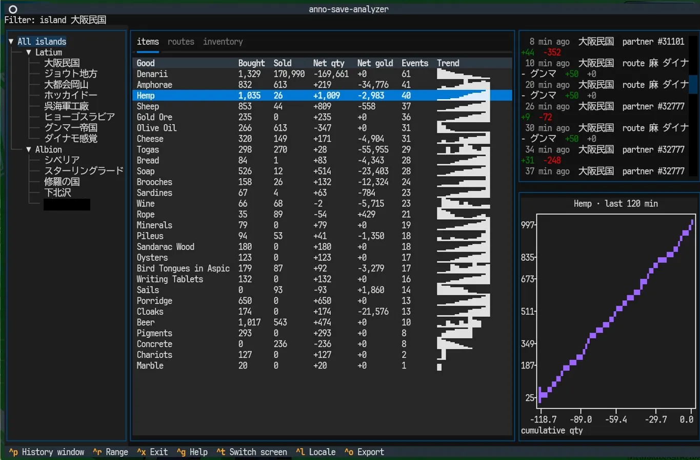
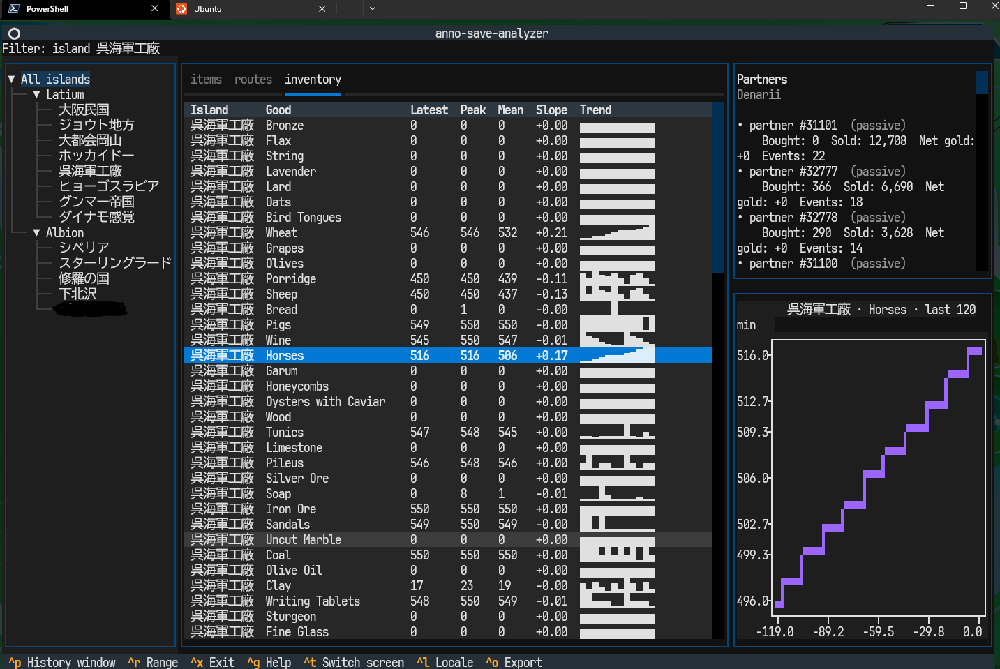

# anno-save-analyzer

[](https://github.com/yuuka-dev/anno-save-analyzer/actions/workflows/ci.yml)
[](https://codecov.io/gh/yuuka-dev/anno-save-analyzer)
[](https://github.com/yuuka-dev/anno-save-analyzer/releases/latest)
[](https://www.python.org/)
[](LICENSE)
[](docs/source/roadmap.md)

> **One-liner**: A terminal app that opens your *Anno 1800* / *Anno 117: Pax Romana* save file and shows you your **trade history** and **island stock levels** — information the game itself does not surface.

> **Status**: v0.4.2 shipped. Installs from a Git tag (PyPI release is planned for v1.0). Japanese README: [README.ja.md](README.ja.md).

---

## What it looks like

| Startup (Overview screen) |
| --- |
|  |
| A cold launch. Picks up how many trade events, routes, and sessions are in the save, plus your running gold balance. |

| Trade history (items tab) | Island inventory (inventory tab) |
| --- | --- |
|  |  |
| For every good you have ever traded: bought/sold totals, net gold, sparkline of volume, the partners who bought from you, and a cumulative chart. | For each island: latest stock, peak, average, slope, and a 120-sample sparkline. Select a row to plot the recent stock curve. |

---

## Why this exists

If you play Anno, you already know the pain:

- **"How much money is route X actually making?"** — the in-game UI doesn't show it.
- **"Which good drains which island?"** — you have to eyeball the warehouse bar and hope.
- **"Did my last trade deal with Ubisoft's AI actually pay off?"** — no way to check after the fact.

The save file actually contains all of this. It is just buried inside a custom archive format (`.a7s` / `.a8s`), then a compressed binary FileDB, then another FileDB nested inside that. This project peels every layer in pure Python and gives you a terminal UI + CLI to read it.

---

## Install

### Prerequisite

Python **3.12 or newer**. Check with:

```bash
python --version
```

If you do not have it, install [uv](https://github.com/astral-sh/uv) — it will handle Python for you.

### One-line install (recommended)

```bash
# Installs the TUI + CLI as a standalone tool (no venv to manage)
uv tool install "anno-save-analyzer[tui] @ git+https://github.com/yuuka-dev/anno-save-analyzer@v0.4.2"
```

After this, the command `anno-save-analyzer` is available anywhere.

### Alternative: plain pip

```bash
pip install "anno-save-analyzer[tui] @ git+https://github.com/yuuka-dev/anno-save-analyzer@v0.4.2"
```

### Alternative: local clone (for contributors)

```bash
git clone https://github.com/yuuka-dev/anno-save-analyzer.git
cd anno-save-analyzer
uv sync --extra tui        # or: python -m venv .venv && .venv/bin/pip install -e '.[tui]'
```

> The `[tui]` extra pulls in Textual + textual-plotext. Drop it if you only want the CLI / library.

---

## First run — step by step

### 1. Find your save file

Anno writes saves to your user documents directory:

| Game | Default save folder (Windows) |
| --- | --- |
| Anno 1800 | `%USERPROFILE%\Documents\Anno 1800\accounts\<account-id>\savegame\` |
| Anno 117 | `%USERPROFILE%\Documents\Anno 117 - Pax Romana\accounts\<account-id>\savegame\` |

Copy one `.a7s` (Anno 1800) or `.a8s` (Anno 117) file somewhere convenient — you can always copy it back to your desktop, for example. **The tool is read-only; it never modifies your save.**

### 2. Launch the TUI

```bash
# Anno 117 save
anno-save-analyzer tui path/to/your_save.a8s --title anno117 --locale en

# Anno 1800 save
anno-save-analyzer tui path/to/your_save.a7s --title anno1800 --locale en
```

You will see a 5-stage loading bar, then the Overview screen (first screenshot above).

### 3. Navigate

Hotkeys are shown in the footer. The important ones:

| Key | Action |
| --- | --- |
| `Ctrl+T` | Switch between **Overview** and **Statistics** screens |
| `Ctrl+L` | Toggle English / Japanese |
| `Ctrl+R` | Cycle the chart time window (last 120 min → 4 h → 12 h → 24 h → all) |
| `Ctrl+P` | Pick the recent-trades window (last 60 min → 120 min → 360 min → 24 h → all) |
| `Ctrl+O` | Export the current view to CSV |
| `Ctrl+G` | Show the help screen |
| `Ctrl+X` | Quit |

On the **Statistics** screen you can click a session or an island in the left tree to filter every table, the partners pane, the chart, and the CSV export to just that subset.

### 4. (Optional) Pull data out as JSON / CSV

If you want to feed the data into a notebook, a spreadsheet, or `jq`:

```bash
# Every individual trade, as JSON on stdout
anno-save-analyzer trade list your_save.a8s --title anno117

# Per-good or per-route aggregate totals
anno-save-analyzer trade summary your_save.a8s --title anno117 --by item
anno-save-analyzer trade summary your_save.a8s --title anno117 --by route

# Diff two saves (what changed between them)
anno-save-analyzer trade diff before.a8s after.a8s --title anno117
```

All sub-commands print JSON to stdout, so you can pipe to `jq`, pandas, DuckDB, or anything else.

---

## Analytics (v0.5 preview)

v0.5 adds a **pandas-native SCM analytics layer** on top of the save parser.
You get seven analyzers that line up with Secretary-General's own decision
matrix: *where is the deficit? is it chronic? which route is weak? what
should I do?*

### Full state → JSON (one-liner for notebooks)

```bash
anno-save-analyzer state sample_anno1800.a7s --title anno1800 --locale ja \
    --out state.json
```

Dumps overview + islands + tier breakdown + balance + full TradeEvent ledger
as a single JSON. `~970 KB` on a typical Anno 1800 save. Load it with
`pandas.read_json` / `pandas.json_normalize` and you are analysis-ready.

### DataFrame layer (Python)

```python
from anno_save_analyzer.analysis import to_frames
from anno_save_analyzer.tui.state import load_state
from anno_save_analyzer.trade.models import GameTitle

state = load_state("sample_anno1800.a7s", title=GameTitle.ANNO_1800, locale="ja")
f = to_frames(state)

# deficit ranking by island
f.islands[["city_name", "deficit_count", "resident_total"]] \
    .sort_values("deficit_count", ascending=False).head(10)

# tier pivot
f.tiers.pivot_table(values="resident_total", index="city_name",
                    columns="tier", fill_value=0)
```

### Decision Matrix (Secretary-General's prescription engine)

```python
from anno_save_analyzer.analysis.prescribe import diagnose, Thresholds

rx = diagnose(f, storage_by_island=state.storage_by_island)

print(rx["category"].value_counts())
# increase_production    (chronic deficit + high saturation + route present)
# rebalance_mix          (route strong but delta < 0)
# trade_flex             (transient deficit + low correlation + weak route)
# ok                     (surplus)
# monitor                (rule-out fallback)

# Okayama's prescriptions
rx[rx["city_name"] == "大都会岡山"] \
    [["product_name", "category", "action", "rationale"]].head(20)
```

Tune thresholds: `diagnose(f, thresholds=Thresholds(high_saturation=0.60))`.

### Other analyzers

| module | function | purpose |
|---|---|---|
| `analysis.deficit` | `deficit_heatmap`, `pareto` | island × product matrix + ABC/Pareto |
| `analysis.correlation` | `saturation_vs_deficit` | Pearson + Spearman per product |
| `analysis.routes` | `rank_routes` | tons/min, gold/min per route |
| `analysis.persistence` | `classify_deficit` | chronic / transient / stable |
| `analysis.sensitivity` | `route_leave_one_out` | "remove one ship — which island breaks?" |
| `analysis.forecast` | `consumption_forecast`, `population_capacity_proxy` | short-term projection |

All analyzers work on both **Anno 117** and **Anno 1800** (title-agnostic pandas in/out).

---

## Feature list (v0.4.2)

### Textual TUI

- **3-column layout**: session / island tree · items / routes / inventory tables · partners pane + time-series chart.
- **Tree filter**: click a session or island node to scope every pane to that subset.
- **Inventory tab**: per-island StorageTrends with latest / peak / mean / slope + sparkline; row selection plots the series.
- **Responsive**: wide (≥120) / mid (80–119) / narrow (<80) breakpoints auto-switch column visibility.
- **Custom route names**: uses your in-game route labels instead of numeric `route_id`s (Anno 117).
- **Recent-trades pane**: picking a good lists the latest 50 individual trades with "N min / h ago" timestamps.
- **Chart time window** (`Ctrl+R`): defaults to the last 120 min so 200+ h saves are not drowned in ancient history.
- **Sparkline column** (`▁▂▃▄▅▆▇█`) for cumulative quantity per good.
- **English / Japanese locale toggle**, with localized session names.
- **Theme option** (`--theme ussr` for a red-on-black palette with a ☭ title prefix).
- **Settings persistence**: locale / theme / chart window / recent-trades window are remembered across launches via `~/.config/anno-save-analyzer/config.toml` (XDG on Linux/macOS, `%APPDATA%` on Windows). Override with `ANNO_SAVE_ANALYZER_CONFIG`.

### CLI

- `trade list <save>` — every trade event as JSON (`--island` / `--session` filters).
- `trade summary <save> --by item|route` — aggregated view.
- `trade diff <before> <after>` — added / removed / changed / unchanged.
- `tui <save>` — launch the Textual viewer.

### Parser

- **RDA V2.2** container parser (clean-room port of [@lysannschlegel/RDAExplorer](https://github.com/lysannschlegel/RDAExplorer)); handles both `.a7s` and `.a8s`.
- **FileDB V3** streaming DOM with tag/attrib dictionaries and recursive `SessionData` extraction.
- **Anno 117 interpreter** for `PassiveTrade > History > {TradeRouteEntries,PassiveTradeEntries}` and `ConstructionAI > TradeRoute > TradeRoutes` (idle routes included).
- NPC-vs-NPC trades filtered out via the `AreaInfo > CityName` gate.

### Data pipeline

- `items_anno117.{en,ja}.yaml` auto-generated from the game's own `config.rda/assets.xml` and `texts_japanese.xml` — 151 Products × 33,146 localized strings. Regenerator at `scripts/generate_items_anno117.py`; run it after a game patch.

### Tests

- 400+ tests, **90 % branch coverage floor** enforced by CI (`fail_under = 90` in `pyproject.toml`).
  Pure-function layers (`parser/*`, `trade.*`) are kept effectively at 100 %; the 90 % floor absorbs `pragma: no cover` friction on async Textual UI code.
- Python 3.12 and 3.13 both supported.

---

## Under the hood

Anno saves are nested containers:

1. `.a7s` / `.a8s` — RDA archive (V2.2 container, shared across Anno 1404 / 2070 / 2205 / 1800 / 117).
2. `data.a7s` inside it — zlib-compressed stream.
3. FileDB V3 binary after decompression.
4. `<SessionData><BinaryData>` — one re-embedded full FileDB V3 document per game session (Latium, Albion, Old World, …).
5. Inside each session: `AreaInfo`, `PassiveTrade > History`, `ConstructionAI > TradeRoute`, …

```text
sample_anno117.a8s  (RDA V2.2 container)
└─ data.a7s  (zlib stream inside RDA)
   └─ outer FileDB V3
      ├─ <SessionData><BinaryData>  (one per session, recursively another FileDB V3)
      │  ├─ AreaInfo > <1> > AreaEconomy > StorageTrends  (inventory time series)
      │  ├─ AreaInfo > <1> > PassiveTrade > History > TradeRouteEntries / PassiveTradeEntries > …
      │  └─ ConstructionAI > TradeRoute > TradeRoutes > <1>  (idle route definitions)
      └─ meta / header / gamesetup.a7s  (handled by RDAArchive)
```

See [docs/source/reference/rda_format_spec.md](docs/source/reference/rda_format_spec.md) and [docs/source/reference/filedb_format_investigation.md](docs/source/reference/filedb_format_investigation.md) for the full write-ups.

---

## Roadmap

| Version | Scope | Status |
| --- | --- | --- |
| v0.1.0 | RDA V2.2 native parser | ✅ done |
| v0.2.x | FileDB V3 parser, recursive SessionData, island metadata | ✅ done (rolled into 0.3.0) |
| v0.3.0 | Trade history viewer: Textual TUI + CLI + snapshot diff | ✅ released |
| v0.4.0 | Per-island inventory + tree filter + responsive layout | ✅ released |
| v0.4.1 | Inventory chart x-axis as relative time | ✅ released |
| **v0.4.2** | **Custom route names + chart time window + recent-trades pane + settings persistence** | ✅ **released** |
| v0.4+ | Data-volume progress gauge ([#26](https://github.com/yuuka-dev/anno-save-analyzer/issues/26)), Anno 1800 parity ([#24](https://github.com/yuuka-dev/anno-save-analyzer/issues/24)) | planned |
| v0.5 | OR-Tools MILP route optimizer | planned |
| v0.6 | Typed Pydantic models across the DOM (Island / Building / Population) | planned |
| v1.0 | PyPI publish, English docs, stable API | planned |

See [docs/source/roadmap.md](docs/source/roadmap.md) / [docs/source/ja/roadmap.md](docs/source/ja/roadmap.md) for the detailed milestones.

---

## Tech stack

| Category | Choice |
| --- | --- |
| Language | Python 3.12+ |
| Package manager | uv (recommended), pip compatible |
| CLI framework | typer |
| XML parser | lxml (`huge_tree=True`, `recover=True`) |
| Data models | pydantic v2 |
| Aggregation | pandas |
| TUI | [Textual](https://github.com/Textualize/Textual) + [textual-plotext](https://github.com/Textualize/textual-plotext) |
| Optimization (optional, v0.5) | OR-Tools |
| Notebook (optional) | JupyterLab (for `notebooks/island_inventory.ipynb`) |
| CI | GitHub Actions, pytest-cov, Codecov |
| Lint / format | ruff |

---

## Testing / development

```bash
uv run pytest --cov=anno_save_analyzer --cov-branch --cov-config=pyproject.toml
uv run ruff check src tests
uv run ruff format --check src tests
```

`fail_under` is read from `pyproject.toml` (currently 90 %).

Tests that need a real save are auto-skipped if none is present. Drop a save as `sample.a7s` or `sample_anno117.a8s` at the repo root, or set `SAMPLE_A7S` / `SAMPLE_A8S`.

---

## Troubleshooting

- **`anno-save-analyzer: command not found`** — `uv tool install` did not add its bin directory to your PATH. Run `uv tool update-shell` (restart your terminal afterwards), or invoke via `uv run anno-save-analyzer ...`.
- **Blank / garbled terminal** — Textual needs a real TTY. Windows: use Windows Terminal or modern PowerShell, not `cmd.exe`.
- **`ValueError: unsupported RDA version`** — the file is not actually an Anno 1800 / 117 save (maybe it's a mod or a different Anno title). Only V2.2 containers are supported.
- **Empty trade list** — you gave the wrong `--title`; the item / session names fall back to raw GUIDs and the trade extractor can't find the interpreter. Make sure `--title` matches the actual game the save came from.

---

## Contributing

Pull requests welcome. See [CONTRIBUTING.md](CONTRIBUTING.md) for the branch strategy, commit conventions (English-subject + optional Japanese body block), Copilot review policy, and coverage expectation. In short:

- Feature work on `feature/*` → `dev` → (release branch) → `main`.
- Every PR requests Copilot review and must keep CI green with branch coverage ≥ 90 %.
- Parser additions should cite a format reference in `docs/`.

---

## Disclaimer

This project is **not affiliated** with Ubisoft, Blue Byte, or the Anno franchise. It is a third-party, read-only analysis tool. *Anno*, *Anno 1800*, *Anno 117: Pax Romana*, *Ubisoft*, *Blue Byte* are trademarks of their respective owners.

## Acknowledgements

- RDA V2.2 format: [@lysannschlegel/RDAExplorer](https://github.com/lysannschlegel/RDAExplorer).
- FileDB format: [anno-mods/FileDBReader](https://github.com/anno-mods/FileDBReader).
- Prior art: [Anno1800SavegameVisualizer](https://github.com/NiHoel/Anno1800SavegameVisualizer), [AnnoSavegameViewer](https://github.com/Veraatversus/AnnoSavegameViewer), [anno1800-save-game-explorer](https://github.com/RobertLeePrice/anno1800-save-game-explorer).

## License

MIT — see [LICENSE](LICENSE).
