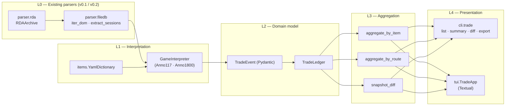

# v0.3.0 — Trade History Viewer: Design Document

> **Status**: Draft, revision 5 (locale-split YAML + UI i18n switcher; W-1 spike result)
> **Target ship**: 2-3 weeks of part-time dev
> **Languages in this doc**: English (primary, OSS-facing). Japanese sibling: [`v0.3-trade-history-design.ja.md`](./v0.3-trade-history-design.ja.md)
> **Last updated**: 2026-04-19

## 1. Overview / 概要

`anno-save-analyzer` v0.3.0 ships a **Trade History Viewer** — a CLI + Textual TUI for inspecting trade activity recorded inside Anno save files (`.a7s`, `.a8s`).

Unlike Anno 1800, **Anno 117: Pax Romana ships without a built-in trade-history UI** (as of patch 1.4 / 2026-04). Ubisoft's *Thorlof* has acknowledged the gap as "on the list" but no ETA exists. This tool fills that gap in pure Python, on top of the v0.1/v0.2 RDA + FileDB parsers.

**Design pillars** (in priority order):

1. **Dogfooding first**: the primary user is the maintainer (書記長), who actively plays Anno 117 and wants per-good and per-route trade insights to inform supply-chain decisions.
2. **Cross-title abstraction**: the data model is title-agnostic so that future Anno releases (or even reimaginings) plug in via a thin interpreter layer.
3. **Bounded scope**: ships in 2-3 weeks of part-time work. Anything that does not directly serve dogfooding is deferred.
4. **Streaming-friendly**: handles 500MB+ inner FileDB binaries via the existing `parser.filedb.iter_dom` streaming iterator.

This document **does not contain implementation code**. It freezes the contract that v0.3 will be built against.

## 2. User Stories / ユーザーストーリー

### 2.1 書記長 (Primary — dogfooding operator)

> 書記長 plays Anno 117 with a deliberate "5-good strategy" to keep cognitive load down.
> Decisions about which routes to keep, which trade partners to favour, and which goods to over-produce currently rely on guesswork because the in-game UI gives no historical view.

- US-1. **As 書記長**, I want to load my latest `.a8s` save and see which goods were traded the most over the last in-game period, so I can verify my 5-good strategy is being respected.
- US-2. **As 書記長**, I want to see per-route balance (cost vs. revenue per active route) so I can kill or rewire routes that bleed gold.
- US-3. **As 書記長**, I want to keep snapshots of my saves over time and compare them, so I can reconstruct trade history even if Anno 117 doesn't record it natively.
- US-4. **As 書記長**, I want everything to run from a terminal — no Electron, no browser — because my daily flow is WSL2 + tmux + Vim.

### 2.2 Anno 117 community (Secondary — English-speaking)

- US-5. **As an Anno 117 player**, I want a CLI command that exports trade history to JSON so I can analyse it in my own spreadsheet/notebook tools.
- US-6. **As an Anno 117 modder**, I want a documented data model so I can write extensions (e.g. enrich GUIDs with mod-specific item names).

### 2.3 Anno 1800 legacy users (Tertiary)

- US-7. **As an Anno 1800 player**, I want the same viewer to work on `.a7s` saves with minimal config (different YAML mapping is acceptable).

## 3. Functional Requirements / 機能要件

### 3.1 Must-have (M) — v0.3.0 ships without these = no release

| ID | Requirement | Notes |
|---|---|---|
| M-1 | Load `.a8s` (Anno 117) and `.a7s` (Anno 1800) via existing `parser.rda` + `parser.filedb`. | Reuses v0.1/v0.2 stack. |
| M-2 | Extract `TradedGoods` records (`GoodGuid`, `GoodAmount`, `TotalPrice`) from inner FileDB sessions. | Confirmed present in `sample_anno117.a8s` Session 0 (47.9MB). |
| M-3 | Resolve `GoodGuid` (int32) to a human-readable name via locale-split YAML files (`data/items_<title>.<locale>.yaml`, e.g. `items_anno117.en.yaml`, `items_anno117.ja.yaml`). At minimum the `en` file ships; other locales are merged in when present. | One file per locale lets translators contribute without merge conflicts. |
| M-4 | Aggregate by item and by route, returning quantity bought/sold and net gold. | Two pivot views. |
| M-5 | CLI: `trade list`, `trade summary --by item`, `trade summary --by route` with `--format json`. | Scriptable. |
| M-6 | Textual TUI: at least 2 screens — Overview and Trade Summary (item/route tabs). | Default `tui` entry point. |
| M-7 | Stream-friendly extraction: peak RSS ≤ 1.5× of source FileDB size. | Reuses `iter_dom` generator chain. |
| M-8 | Display "N minutes ago" for each trade event by diffing event timestamp against the save's current game tick. | Critical for human readability. See §9.4. |
| M-9 | UI defaults to English. CLI accepts `--locale en|ja`; TUI exposes a settings screen (or `^L`) to switch live without restart. Persisted in `~/.config/anno-save-analyzer/config.toml`. | English-first, opt-in Japanese. Translators add a locale by dropping one YAML and registering one string table. |

### 3.2 Should-have (S) — strong candidates if 2-week budget allows

| ID | Requirement |
|---|---|
| S-1 | Snapshot diff (Method B): given two saves, infer trade events from inventory deltas. |
| S-2 | Route detail screen in TUI: ships, stations, last visited, balance trend. |
| S-3 | Export formats: HTML (single-file), CSV, Markdown. |
| S-4 | Item interpreter for unknown GUIDs falls back to `Good_<guid>` rather than blocking. |
| S-5 | Detect Anno 1800 vs Anno 117 from outer dictionary signature, auto-select interpreter. |
| S-6 | Inline sparkline graphs in TUI table rows (Unicode block `▁▂▃▄▅▆▇█`) for per-good amount-over-time and per-route balance trend. Uses Textual's `Sparkline` widget. |
| S-7 | Full line-chart in the right context pane when a good or route is selected, modelled after the Anno 1800 statistics view. Uses `textual-plotext` (PlotextPlot widget); X axis = in-game time, Y axis = stock or balance. |

### 3.3 Nice-to-have (N) — explicitly deferred to v0.3.1+

| ID | Requirement | Defer reason |
|---|---|---|
| N-1 | PowerShell scheduled-task helper for automatic snapshotting. | OS-specific, ships as docs/snippet. |
| N-2 | Trade-partner detail screen (per-NPC view). | Less load-bearing for the 5-good strategy. |
| N-3 | Charts (sparklines, bar graphs in TUI). | Cosmetic. |
| N-4 | Mod-aware GUID dictionary auto-merge. | Requires mod ecosystem reverse engineering. |
| N-5 | Web export with embedded D3 charts. | Out of scope for terminal-first MVP. |

## 4. Non-functional Requirements / 非機能要件

| Aspect | Target |
|---|---|
| **Performance** | Cold load + summary on a 500MB inner FileDB ≤ 30s on the maintainer's WSL2 box (Ryzen + RTX 3080, but CPU-bound). |
| **Memory** | Peak RSS during a single-save extraction ≤ 1.5× the inner FileDB size. Snapshot diff ≤ 2.5× the larger snapshot. |
| **Cross-platform** | Linux / WSL2 first; macOS and Windows native expected to work via Textual + stdlib. No platform-specific deps in core. |
| **Determinism** | Same input → identical output bytes (JSON / CSV). Critical for snapshot-diff regression tests. |
| **Test coverage** | Maintain repo-wide 100% line+branch coverage gate (`--cov-fail-under=100`). |
| **i18n** | English is the default for both UI strings and item names. Japanese ships in v0.3.0 as the second supported locale via locale-split YAML and a `Locale` runtime switcher. Adding a new locale = drop one YAML + register one string table. |

## 5. Data Model / データモデル

### 5.1 Cross-title abstract layer

All trade data is normalised into a title-agnostic `TradeEvent` stream. Per-title quirks live behind a single `GameInterpreter` strategy class.

```python
# Pseudo-Pydantic (final API to be locked in v0.3 implementation PR)

class GameTitle(StrEnum):
    ANNO_1800 = "anno1800"
    ANNO_117  = "anno117"

class Item(BaseModel):
    guid: int                       # raw GoodGuid
    names: dict[str, str]           # locale code → name; "en" required.
                                    # Fallback when missing: f"Good_{guid}"
    category: str | None = None     # e.g. "raw", "consumer", "luxury"

    def display_name(self, locale: str) -> str:
        return self.names.get(locale) or self.names.get("en") or f"Good_{self.guid}"

class TradingPartner(BaseModel):
    id: str                    # internal (Trader id, NPC name, route id)
    display_name: str
    kind: Literal["passive", "active", "route", "unknown"]

class TradeEvent(BaseModel):
    """Single line in a trade ledger — title-agnostic."""
    timestamp: GameTimestamp | None        # in-game tick or wall-clock if known
    item: Item
    amount: int                            # signed: + buy / - sell
    total_price: int                       # signed: + gold in / - gold out
    partner: TradingPartner | None = None
    route_id: str | None = None
    session_id: str | None = None          # 5 sessions in 1800, 2 in 117
    source_method: Literal["history", "diff"] = "history"

class TradeLedger(BaseModel):
    title: GameTitle
    save_path: Path
    events: list[TradeEvent]

# Aggregations are projected on demand, never stored.
class ItemSummary(BaseModel):
    item: Item
    bought: int                # sum of positive amounts
    sold: int                  # sum of |negative amounts|
    net_gold: int

class RouteSummary(BaseModel):
    route_id: str
    route_name: str | None
    bought: int
    sold: int
    net_gold: int
    event_count: int
```

### 5.2 GameInterpreter strategy

```python
class GameInterpreter(Protocol):
    title: GameTitle
    item_dictionary_path: Path           # data/items_<title>.yaml

    def find_traded_goods(
        self,
        outer_filedb: bytes,
        outer_section: TagSection,
    ) -> Iterator[RawTradedGoodTriple]:
        """Yield (GoodGuid, GoodAmount, TotalPrice, ctx) tuples
           by walking the inner-session DOMs."""

    def resolve_route(self, ctx: ExtractionContext) -> str | None: ...
    def resolve_partner(self, ctx: ExtractionContext) -> TradingPartner | None: ...
```

Two concrete classes ship in v0.3.0: `Anno117Interpreter`, `Anno1800Interpreter`. Adding a future title means writing one new class + one YAML.

### 5.3 YAML item dictionary (locale-split)

One YAML per `(title, locale)` pair. The English file is canonical for
non-name metadata (`category`, etc.); other locales carry only `name`. Loader
merges them at runtime keyed by GUID.

```yaml
# data/items_anno117.en.yaml — canonical English file
2088:
  name: "Wood"
  category: "raw"
2073:
  name: "Bricks"
  category: "construction"
```

```yaml
# data/items_anno117.ja.yaml — Japanese names only
2088:
  name: "木材"
2073:
  name: "煉瓦"
```

Loader pseudo-API:

```python
items = ItemDictionary.load(title="anno117", locales=["en", "ja"])
items[2088].display_name("ja")  # → "木材"
items[2088].display_name("fr")  # → "Wood" (falls back to en)
items[9999].display_name("en")  # → "Good_9999" (unknown GUID)
```

`scripts/scaffold_items_yaml.py` (delivered with v0.3) scans a save and emits
an English-only YAML stub with all GUIDs found. Translators copy the stub to
`<title>.<locale>.yaml` and replace names; non-name fields are inherited from
the `.en.yaml` at load time.

## 6. Architecture / アーキテクチャ



**Module breakdown** (planned package layout):

```
src/anno_save_analyzer/
├── parser/             # L0 (existing)
├── trade/
│   ├── __init__.py
│   ├── models.py       # L2 — Pydantic
│   ├── interpreter/
│   │   ├── base.py
│   │   ├── anno117.py
│   │   └── anno1800.py
│   ├── extract.py      # L1 wiring + Method A/B router
│   ├── diff.py         # L3 — snapshot diff
│   ├── aggregate.py    # L3 — by-item / by-route projections
│   └── items.py        # L1 — YAML dictionary loader
├── cli/
│   └── trade.py        # L4 — Click/Typer subcommands
└── tui/
    ├── app.py          # L4 — Textual app
    ├── screens/
    │   ├── overview.py
    │   ├── trade_summary.py
    │   └── route_detail.py  # S-2
    ├── theme.py        # subdued default-theme overrides
    ├── i18n.py         # Locale switcher + UI string-table loader
    ├── locales/
    │   ├── en.yaml     # UI string keys → English
    │   └── ja.yaml     # UI string keys → 日本語
    └── widgets/
        ├── trend_arrow.py    # ▲/▼/= renderer
        ├── partners_pane.py  # right-context partner list
        └── stock_chart.py    # textual-plotext line chart (S-7)
```

## 7. Data Flow / データフロー

### 7.1 Method A (history-field extraction) — single save

```
.a8s file
   │   parser.rda.RDAArchive
   ▼
data.a7s (zlib)
   │   pipeline.extract_inner_filedb
   ▼
outer FileDB V3 (88MB)
   │   parser.filedb.parse_tag_section
   ▼
TagSection (597 tags · 531 attribs)
   │   parser.filedb.extract_sessions
   ▼
inner sessions[] (47MB · 28MB ...)
   │   trade.interpreter.Anno117Interpreter
   │     walk inner DOM, locate <TradedGoods>, yield triples
   ▼
RawTradedGoodTriple stream (generator)
   │   trade.extract.normalise(items_yaml, interpreter)
   ▼
Iterator[TradeEvent]
   │   trade.aggregate.by_item / by_route
   ▼
ItemSummary[] / RouteSummary[]
   │
   ▼
CLI (JSON) or TUI (Textual table)
```

### 7.2 Method B (snapshot diff) — two saves

```
save_t0.a8s ──► TradeLedger_A0  (history events seen so far)
save_t1.a8s ──► TradeLedger_A1
       │
       ▼
trade.diff.snapshot_diff(t0, t1)
       │  diffs warehouse stocks per island,
       │  attributes deltas to the time window [t0, t1]
       ▼
Iterator[TradeEvent]   (source_method="diff")
       │
       └─► same downstream pipeline as Method A
```

The two methods produce the **same `TradeEvent`** type. Downstream code does not branch on which method produced an event; it can be filtered or merged using `source_method`.

## 8. Extraction Strategy / 抽出戦略

### 8.1 Method A — history-field extraction

**Confirmed candidates** (from the spike on `sample_anno117.a8s`):

| Tag (inner session) | id | Status |
|---|---|---|
| `<TradedGoods>` containing `{GoodGuid, GoodAmount, TotalPrice}` triples | 29 | ✅ Confirmed populated. Primary source. |
| `<ActiveTradeHandler>` (ships + lastVisited) | 552 | ✅ Confirmed; useful for route attribution. |
| `<GoodsTradeHandler>` with `LastGoodTradeUpdate` timestamp | 600 | ✅ Confirmed; provides per-update wall clock. |
| `<LastRouteResult>` | 167 | ⚠ Empty in the sampled save; revisit with a longer-played save. |

**Outer FileDB candidates** (top-level):

| Tag | id | Status |
|---|---|---|
| `<ActiveTradeHistory>` | 534 | ⚠ Tag exists but **empty** in sample. May only populate after specific events. |
| `<SessionTradeRouteManager>` / `<RouteMap>` | 496 / 497 | 🔍 Structure not yet inspected — see Open Question Q-1. |
| `<TradeContractManager>` (and `<ActiveContract>`) | — / 544 | ✅ Tag exists; useful for contract metadata. |

**Extraction algorithm (pseudocode)**:

```
walk inner_session DOM:
  on <TradedGoods> open  → start collecting
  on each child <item (id=1)>:
    capture GoodGuid, GoodAmount, TotalPrice
  on <TradedGoods> close → flush triples with parent context as route_id/partner
walk outer DOM in parallel for <ActiveTradeHandler>:
  capture ship→route mapping for attribution
```

### 8.2 Method B — snapshot diff

**Use case**: Anno 117 may not retain a long history of `<TradedGoods>`. Method B reconstructs trade activity from periodic save snapshots maintained by the user.

**Algorithm**:

1. Load snapshot `t0` and `t1`. Compute per-island per-good inventory.
2. For each `(island, good)`, take `Δ = stock(t1) - stock(t0)`.
3. Subtract known production/consumption derived from buildings (using `GoodsTradeHandler.ProductGainPerArea`).
4. Residual `Δ` is attributed to a synthetic `TradeEvent` with `source_method="diff"`.
5. Match deltas across islands within the same session to infer counterparties when possible.

**Caveats**:
- Less precise than Method A (no per-event timestamp).
- Cannot detect short trades that net to zero between snapshots.
- Should be presented to users with an honesty label ("inferred from snapshot delta").

### 8.3 Common interface

Both methods are exposed as iterators returning `TradeEvent`. Callers (CLI / TUI / aggregate) do not branch on the method; they may filter via `event.source_method`.

```python
def extract(
    save_or_pair: Path | tuple[Path, Path],
    interpreter: GameInterpreter,
    items: YamlDictionary,
) -> Iterator[TradeEvent]: ...
```

## 9. UI Specification / UI 仕様

### 9.1 Textual TUI layout

**Reference**: the layout is modelled after the in-game **Anno 1800 Statistics
view** (3-column structure: session/island tree, central data table, contextual
right pane that flips between partner-by-partner balances and a per-good time
chart). Reference screenshots live locally in `_screenshots/` (gitignored for
copyright reasons; do not commit).

**Style guide** — subdued, no decorative themes:

- Use Textual's default theme; lean on terminal-default colours where possible.
- Two accents only: terminal-red for negatives, terminal-green for positives
  (mirrors the in-game `▲ green / ▼ red` trend arrows in the screenshots).
- Selection / focus highlight uses terminal-default reverse video.
- Monospace by definition (terminal). No emojis, no decorative glyphs, no
  ASCII-art logos.
- Footer always shows: `[anno-save-analyzer · v0.3.0]` left, save path right.

**Screens (MVP — 2 screens for v0.3.0; +1 for S-2)**:

#### Screen 1 — Overview

```
┌─ Overview ──────────────────────────────────────────────────────┐
│ Save  : sample_anno117.a8s  (88 MB outer · 2 sessions)          │
│ Title : Anno 117: Pax Romana                                    │
│ Played: ~14h (estimate from GameTotal)                          │
│ Now   : tick 0x080918f8                                         │
│                                                                 │
│ ─ Sessions ──────────────────────────────────────────────────── │
│   #0  47.9 MB   871 tags                                        │
│   #1  28.0 MB   …                                               │
│                                                                 │
│ ─ Trade snapshot ────────────────────────────────────────────── │
│   Total ledger events  : 1,284                                  │
│   Distinct goods       : 23                                     │
│   Distinct routes      : 7                                      │
│   Net gold (period)    : +12,340                                │
│                                                                 │
│ [t]rade statistics  [r]oute detail  [d]iff  [q]uit              │
└─────────────────────────────────────────────────────────────────┘
```

#### Screen 2 — Trade Statistics (3-column, mirrors Anno 1800 統計)

Three vertical regions, resizable with `[` / `]`:

- **Left (Tree)**: sessions × islands. The user picks one entry; the central
  table re-loads for that scope. Top entry "All islands" aggregates the title.
- **Centre (DataTable)**: per-good rows for the selected scope. Columns mirror
  the in-game statistics screen — stock, production rate, consumption rate,
  trend arrow (`▲`/`▼` with green/red), net amount, last-seen.
- **Right (Context pane)**: tab strip switches between
  - **Partners** — list of trading partners (NPC traders + own routes) for the
    selected good / island, with `+N` / `−N` counters and `N min ago` labels
    (this is the part the screenshots show in image 2).
  - **Chart** — line chart of stock-over-time for the selected good
    (image 3). Backed by `textual-plotext` (S-7).

```
┌─ Trade Statistics ────────────────────────────────────────────────────────────┐
│ Sessions / Islands │ Goods (Old World > Moskva)        │ Context [partners│chart]│
│ ────────────────── │ ─────────────────────────────────  │ ──────────────────────  │
│ ▾ All islands      │ Good          Stock  Δ   Prod Cons│ ▾ Tobias Trader  +154 g │
│                    │ Wood          3,250  ▲   12   8   │     ▼5 Wood     13 min  │
│ ▾ Old World        │ Bricks        1,140  ▼   4    9   │     ▲4 Bricks    9 min  │
│   • Saint-Pet…     │ Wine            780  =   0    0   │     ▼6 Wine      9 min  │
│   • Moskva    ◀    │ Wool          1,250  ▲   8    3   │ ▾ Madam Kahina   −12 g  │
│   • Vladivost…     │ ▶ Rum         2,697  ▼   3   28   │     ▼3 Rum      45 min  │
│                    │ Sugar           226  ▼   2    7   │     ▲5 Sugar    52 min  │
│ ▾ Trelawney Cape   │ Cotton          410  ▲   6    4   │ ▾ Player route #3  +84 │
│   • Omsk           │                                    │     ▼20 Wood    3 min  │
│   • Khabarovs…     │                                    │     ▲20 Bricks  3 min  │
│ ▸ New World        │                                    │                        │
│                    │                                    │                        │
│ ↑/↓ select  [/]   │ j/k row · / filter · s sort        │ ←→ tab · g chart       │
└───────────────────────────────────────────────────────────────────────────────┘
```

When the user toggles `g` (or selects the **Chart** tab), the right pane swaps
to a `textual-plotext` line chart (S-7). Sparklines (S-6) coexist as an
optional column inside the central table.

```
┌─ Context [ partners │ chart ] ─────────────┐
│ Rum — stock over time (Moskva, last 24 hr) │
│  3000 ┤                                    │
│  2500 ┤      ●─●─●●●                       │
│  2000 ┤  ●●●●     ●●●●●●●●                 │
│  1500 ┤                       ●●●●●●●●●●●● │
│  1000 ┤                                    │
│       └─┬───┬───┬───┬───┬───┬───┬───┬───   │
│         0   3   6   9  12  15  18  21  24h │
└────────────────────────────────────────────┘
```

#### Screen 3 — Route Detail (S-2; deferred if budget tight)

When S-6/S-7 ship, the per-cycle balance renders as both a sparkline (compact)
and a plotext line chart (when the screen has the focus and is taller).

```
┌─ Route #3: Forum → Aquilonia ─────────────────────────────────┐
│ Status : Active     Owner: Player1     Ships: 2               │
│ Last visited: tick 0x080918f8 (≈14 min ago)                   │
│                                                               │
│ Cargo manifest (latest cycle):                                │
│   Wood       +20 → −20 (delivered)                            │
│   Bricks     +8  → −8                                         │
│                                                               │
│ Balance, last 10 cycles  : +1,240 gold                        │
│ Trend (S-6)              : ▁▂▃▄▅▆▇█                            │
│                                                               │
│ Per-cycle balance (S-7):                                      │
│   200 ┤ ●           ●                                         │
│   100 ┤   ●   ● ●                                             │
│     0 ┤     ●           ●   ●                                 │
│  −100 ┤                   ●                                   │
└───────────────────────────────────────────────────────────────┘
```

**Hotkey philosophy**: nano-flavored, Decided in rev 4. The bottom of every screen
shows a permanent menu bar (Textual `Footer`) listing the active bindings,
mirroring nano's two-line shortcut hint.

| Key | Action |
|---|---|
| `^X` | exit / back |
| `^G` | help / show all bindings |
| `^W` | filter (where-is) |
| `^O` | export (write-out) |
| `^P` / `^N` | up / down (previous / next row) |
| `^V` / `^Y` | page down / page up |
| `^A` / `^E` | top / bottom of list |
| `Tab` | switch right-pane tab (partners ↔ chart) |
| `Alt+←` / `Alt+→` | shift focus between left / centre / right panes |
| `Alt+\` | first row in current scope |
| `Alt+/` | last row in current scope |
| `Esc` `Esc` | meta command palette (e.g. `:export csv`) |

The menu bar reserves at most six bindings per row (e.g. `^X Exit  ^G Help
^W Find  ^O Export  Tab Pane  Esc:Esc Cmd`); secondary bindings are listed in
`^G` help.

The same key contract is used across all screens. Screen-specific shortcuts
(e.g. `^T` jump to trade statistics, `^R` jump to route detail) are listed in
the per-screen Footer.

### 9.2 CLI surface

```
anno-save-analyzer trade list <save>
    --format json|csv|md|html      (default: json)
    --since <tick>                 (filter)
    --session <0|1|...>            (filter)

anno-save-analyzer trade summary <save>
    --by item|route|partner        (default: item)
    --format json|csv|md|html      (default: csv)
    --top <N>

anno-save-analyzer trade diff <save_old> <save_new>
    --format json|csv|md|html

anno-save-analyzer tui <save>
    --no-color                     (CI-friendly)
```

`anno-save-analyzer scaffold-items <save> > stub.yaml` ships as a helper to bootstrap the YAML dictionary.

### 9.3 Visual style guide

- Default Textual theme. No bespoke palette, no decorative glyphs, no logos.
- One accent only: terminal-red for negative balances and warnings.
- Selection / focus uses terminal-default reverse video.
- All numerical formatting uses locale-independent comma grouping; gold values prefixed with `+` / `−` and a fixed-width `g` suffix.
- Time-deltas formatted as `N sec`, `N min`, `N hr`, `N d` ago — see §9.4.

### 9.4 Time-ago formatting / 「N 分前」表示

Each `TradeEvent` carries an optional `timestamp` in **game ticks** (uint64 from
`LastGoodTradeUpdate` and similar). The save's *current* tick is taken from the
outermost `<Timer>` / `<GameTotal>` attrib (precise location to be locked in
implementation). The TUI displays:

```
delta_ticks = current_tick - event.timestamp
delta_sec   = delta_ticks * SECONDS_PER_TICK
```

`SECONDS_PER_TICK` is a per-title constant determined empirically. As of this
draft, the assumption is **Anno 117 ≈ 0.05 s/tick (20 ticks/sec)**, consistent
with the Anno 1800 simulation rate; the constant lives in
`trade.interpreter.<title>.GameTimebase` and is overridable via
`--seconds-per-tick` for paranoid users.

Display rules:

| Δ                | Format            |
|------------------|-------------------|
| < 60 s           | `N sec ago`       |
| < 60 min         | `N min ago`       |
| < 24 hr          | `N hr ago`        |
| ≥ 24 hr          | `N d ago`         |
| timestamp absent | `—`               |

JSON export keeps the raw tick (`timestamp_tick`) and the resolved seconds
(`age_sec_at_export`); the human label is computed by consumers.

## 10. Risk Analysis / リスク分析

| ID | Risk | Likelihood | Impact | Mitigation |
|---|---|---|---|---|
| R-1 | `RouteMap` ↔ `TradedGoods` parent-child relation differs from assumption. | Medium | Medium | Q-1 spike before implementation; extraction code factored to allow alternative attribution. |
| R-2 | `TradedGoods` is a rolling window, not full history (loses old events). | High | Medium | Method B (snapshot diff) is precisely the workaround; ship both. |
| R-3 | `GoodsTradeHandler.LastGoodTradeUpdate` is the only timestamp; cannot order events finer than one save. | High | Low | Document the limitation; expose timestamp at ledger granularity, not per-event. |
| R-4 | Anonymous attrib `id=0x8000` semantics differ between Anno 1800 and Anno 117. | Medium | Low | Interpreter handles per-title; `data/items_*.yaml` carries the diff. |
| R-5 | Inner FileDB for very late-game saves blows past 500MB. | Low | Medium | All extraction paths are generator-based; no full DOM materialisation. |
| R-6 | Textual API churn between v0.x releases. | Medium | Low | Pin minor version in `pyproject.toml`; isolate Textual imports to `tui/` package. |
| R-7 | 100% coverage gate slows iteration on UI code. | Medium | Low | Use Textual's `pilot` for snapshot tests; gate UI modules on visual tests instead of branch coverage where appropriate. |
| R-8 | Snapshot-diff false positives if user pauses with goods in transit. | Medium | Low | Display synthetic events with prominent "inferred" badge; allow `--exclude inferred`. |
| R-9 | Anno 117 patch changes tag dictionary (inevitable). | High | Medium | Interpreter looks up tags by name, not by hard-coded id; `extract` dies loudly if a required name is missing. |
| R-10 | Maintainer (書記長) gets pulled into job hunt and ships nothing. | High | High | Scope is set so that even M-1 to M-6 alone delivers dogfooding value; S/N items are explicitly skippable. |
| R-11 | 3-column layout + plotext line chart inflates Week 2 scope. | High | Medium | If Week 2 slips, ship a 1-column fallback (centre table only, partners pane disabled) and push the 3-column + chart to v0.3.1. M-1〜M-8 still deliver. |
| R-12 | `textual-plotext` API churn or rendering bugs in narrow terminals. | Medium | Low | Pin minor version. Detect terminal width; degrade gracefully to S-6 sparkline only when width < 60 cols. |

## 11. Non-goals / 非目標

The following are explicitly **out of scope** for v0.3.0:

- Save editing or any write-back to `.a8s` / `.a7s`.
- Real-time monitoring / file watchers.
- GPU acceleration, distributed processing, or cloud sync.
- Web UI, browser-based viewer, Tauri desktop app (deferred indefinitely).
- Mod-loader integration or mod-tag dictionary auto-merge.
- Predictive analytics / recommendation engine (that is v0.5 MILP territory).
- Localisation infrastructure beyond `name_en` / `name_ja` in YAML.
- Multi-save batch dashboard (Method B handles two-save diff; N-saves is N+1).
- Anno 1404 / 2070 / 2205 support (RDA layer reads them, but no domain model planned).

## 12. Implementation Plan (high-level) / 実装計画

Three weekly chunks; each ends with a green CI run and a tagged checkpoint.

### Week 1 — Core extraction + CLI

- `trade.models` Pydantic schemas
- `trade.items` YAML loader + `scaffold-items` helper
- `trade.interpreter.Anno117Interpreter` (M-2 / M-3 / M-4 / M-5)
- `cli.trade list` and `cli.trade summary` with JSON output
- Anno 1800 interpreter wired in (skeleton; full coverage in week 3)

**Exit criterion**: `anno-save-analyzer trade summary --by item sample_anno117.a8s` prints a sane table.

### Week 2 — Textual TUI MVP (3-column statistics)

- `tui.app` + Overview screen
- Trade Statistics screen — Tree (left) + DataTable (centre) + Partners pane (right)
- `theme.py` (subdued overrides)
- `pilot`-based snapshot tests for at least: tree navigation, table sort, pane focus
- Sparkline column (S-6) hooked into the central DataTable

**Exit criterion**: `anno-save-analyzer tui sample_anno117.a8s` boots, the
3-column layout renders, picking an island in the tree updates the centre
table, picking a good in the table updates the partners pane.

**Slip plan**: if 3-column layout overruns, fall back to centre-table-only and
push the partners pane and chart to v0.3.1 (R-11).

### Week 3 — Charts, Method B, polish

- `textual-plotext` line chart (S-7) — stock-over-time for selected good in the
  right pane; per-cycle balance for routes
- `trade.diff.snapshot_diff` (S-1)
- Route detail screen (S-2)
- Export formats CSV / Markdown / HTML (S-3)
- Anno 1800 full coverage + interpreter parity
- Documentation pass (`README.ja.md`, `docs/usage.md`)
- Optional: PowerShell snapshot scheduler doc snippet (N-1)

**Exit criterion**: v0.3.0 release PR open, all CI green, 100% coverage maintained, ✅ from 書記長.

If week 3 slips, ship v0.3.0 with M-only + 3-column layout (no chart, no diff)
and push the rest into v0.3.1.

## 13. Open Questions for 書記長 / 書記長への確認事項

These block or shape implementation. Decide before week 1 starts.

| ID | Question | My recommendation |
|---|---|---|
| **Q-1** | Is `<TradedGoods>` always a direct child of `<RouteMap>` / `<Route>`, or can it appear in other contexts? Needs a 10-min hex-dump spike on `sample_anno117.a8s` Session 0. | Spike before week 1. Without it, route attribution is uncertain. |
| **Q-2** | Does the Anno 117 outer `<ActiveTradeHistory>` ever populate? Need a save with significant trade volume to confirm. | Capture a fresh save after several hours of trade and re-spike. |
| **Q-3 (Decided)** | TUI hotkey style: Vim vs nano vs other. | **nano-flavored** (`^X` exit, `^G` help, `^W` find, `^O` export, `^P/^N` row nav, `Tab` pane swap). Footer menu bar always visible. |
| **Q-4 (Decided)** | Default snapshot interval for Method B documentation. | **15 min** for active sessions; **60 min** for casual play. Both documented as recommendation. |
| **Q-5 (Decided)** | Export format priority. | **JSON > HTML > CSV > Markdown.** JSON for integrations, HTML for shareables, CSV for spreadsheets, Markdown for forum posts. |
| **Q-6 (Decided, revised in rev 5)** | Item YAML scope and language. | **Locale-split** files (`items_<title>.<locale>.yaml`). English file is canonical (carries `category`, etc.); per-locale files carry only `name`. Pre-populate top 20 goods in `en`; Japanese ships as a parallel translation. `scaffold-items` emits English stubs. |
| **Q-7 (Decided)** | TUI visual theme. | **Subdued default** (no logos, no `☭`, no bespoke palette). Two accents only: terminal-red for negatives, terminal-green for positives. |
| **Q-8 (Decided)** | Snapshot-diff inferred events default behavior. | **Include in default ledger** with `source: diff` flag; consumers filter via `--exclude inferred`. |
| **Q-9 (Decided)** | `SECONDS_PER_TICK` measurement methodology. | Take **two saves at exactly 1-minute intervals** during Week 1 spike, diff tick counts, divide. Lock the constant in `trade.interpreter.<title>.GameTimebase`. |
| **Q-10 (Decided)** | Chart library choice. | **`textual-plotext`** (Textual widget around `plotext`). Axes / ticks / resize handled; degrade to S-6 sparkline when terminal width < 60 cols. |
| **Q-11 (Decided)** | Reference screenshots storage. | **Local-only `_screenshots/`** directory, gitignored. Design doc carries verbal references; screenshots are personal aide-memoire, not redistributable (Ubisoft / BlueByte copyright). |

### Open work items (not user decisions, deferred to implementation)

| ID | Work item | When |
|---|---|---|
| W-1 (Done, rev 5) | Confirm `<TradedGoods>` parent. | **Resolved**. See Appendix C. Parents are `PassiveTrade > History > TradeRouteEntries / PassiveTradeEntries`, not `<RouteMap>`. |
| W-2 | Investigate whether outer `<ActiveTradeHistory>` populates in long-played saves. | When 書記長 supplies a long-played save. Non-blocking; inner `<TradedGoods>` is sufficient. |

---

## Appendix A — Spike findings (2026-04-19, `sample_anno117.a8s`)

Reproducible via the v0.2 parser (already merged in `feature/filedb-parser`):

```
RDA: V2.2  ·  4 entries  ·  data.a7s compressed = 4,809,488 B
outer FileDB V3:  88,274,384 B  ·  597 tags · 531 attribs
inner sessions: 2 (47.9 MB · 28.0 MB), both recursive FileDB V3

Outer trade-related tags (selected):
  ActiveTradeHistory(534) · SessionTradeRouteManager(496) · TradeRouteHandler(166)
  TradeRoutes(168) · RouteMap(497) · ActiveContract(544) · TradeShips · TradeWait

Inner Session 0 trade payload (selected):
  TradedGoods(29) — populated, items have {GoodGuid, GoodAmount, TotalPrice}
  ActiveTradeHandler(552) — populated, ships + lastVisited
  GoodsTradeHandler(600) — LastGoodTradeUpdate timestamp + ProductGainPerArea
  Trader(304) · TradedGoods(29) · CurrentTradePartnerArray(683)

Confirmed signed-int32 semantics on TradedGoods:
  GoodAmount > 0 → bought  ·  GoodAmount < 0 → sold
  TotalPrice corresponds; sign opposite to amount in normal trades
```

Full hex/sample available on request — see commit `0cfc746` (PR #16).

## Appendix B — W-1 spike result (2026-04-19): TradedGoods parent paths

Discharged immediately after rev 5. Reproduced on `sample_anno117.a8s`
(2 inner sessions, recursive FileDB V3) by walking the inner DOM with
`parser.filedb.iter_dom` and recording the tag stack at every
`<TradedGoods>` open event:

| Parent path (inner Session DOM) | Session 0 | Session 1 |
|---|---:|---:|
| `PassiveTrade > History > TradeRouteEntries > <1> > <1> > TradedGoods` | 1,237 | 574 |
| `PassiveTrade > History > PassiveTradeEntries > <1> > <1> > TradedGoods` |   296 | 189 |
| `GameObject > objects > <1> > ConstructionAI > EventBuffer > TradedGoods` |     3 |   2 |

### Implications for the extractor

- The dominant container is `PassiveTrade > History`, splitting into
  **`TradeRouteEntries`** (player-owned routes) and **`PassiveTradeEntries`**
  (direct NPC trade).
- Each entry is wrapped twice: outer `<1>` likely keys by route / partner
  (siblings in `<1>` carry attribs such as `RouteID`, `TraderGUID`); inner
  `<1>` is the per-visit / per-transaction wrapper.
- The third path (`ConstructionAI / EventBuffer`) is residual noise (5 events
  total) and the extractor should skip it explicitly.

### Updated extraction policy (supersedes §8.1 first-draft assumption)

The Week 1 interpreter walks each inner Session DOM and:

1. Recognises only `PassiveTrade > History > TradeRouteEntries` and
   `PassiveTrade > History > PassiveTradeEntries` as valid `<TradedGoods>`
   ancestors.
2. Tags each emitted `TradeEvent` with `partner.kind = "route"` or
   `"passive"` based on which subtree it came from.
3. Carries the outer-`<1>` attribs (`RouteID` / `TraderGUID` / etc.) as
   `route_id` / `partner.id`.
4. Skips `ConstructionAI / EventBuffer` occurrences explicitly; the current
   Week 1 implementation does so silently (no `WARN` log).

The original "RouteMap > Route > TradedGoods" hypothesis from rev 1 is
formally discarded.

## Appendix C — Glossary / 用語集

| Term | Meaning |
|---|---|
| RDA V2.2 | The outer container format (`Resource File V2.2`) common to Anno 1404/2070/2205/1800 and confirmed for Anno 117. |
| FileDB V3 | The inner BBDom format used by Anno 1800 and Anno 117. End-of-file magic `08 00 00 00 FD FF FF FF`. |
| SessionData / BinaryData | A FileDB attrib whose payload is itself a complete FileDB V3 document. |
| Method A | Extracting trade events directly from in-save history fields (`<TradedGoods>` etc.). |
| Method B | Reconstructing trade events from periodic snapshot inventory diffs. |
| 5-good strategy / 5物資戦略 | The maintainer's deliberate restriction to a small good set to keep cognitive load down. |
| Sparkline | Single-line micro-graph rendered via Unicode block glyphs `▁▂▃▄▅▆▇█`. |
| Game tick | The atomic simulation step inside the Anno engine. Several attribs (e.g. `LastGoodTradeUpdate`) carry uint64 ticks. |
| `textual-plotext` | Textual widget (`PlotextPlot`) wrapping the `plotext` terminal-charting library. Renders line / bar / scatter charts with Unicode glyphs. |

---

*End of design document. v0.3.0 implementation starts only after 書記長 review-OK.*
