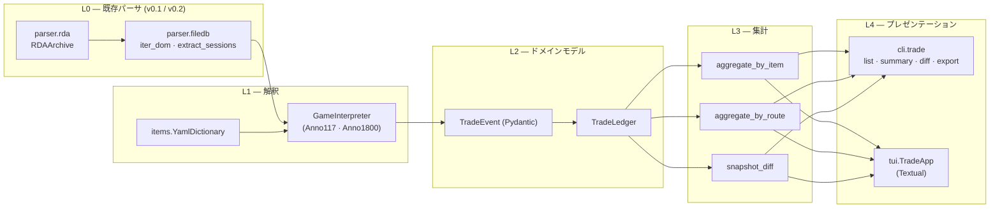

# v0.3.0 — 貿易履歴ビューア 設計書（日本語版）

> **状態**: 草案 (revision 2、書記長レビュー反映後)
> **目標出荷**: 兼業 2-3 週間
> **言語**: 日本語版（書記長用）．英語正本は [`v0.3-trade-history-design.md`](./v0.3-trade-history-design.md)
> **最終更新**: 2026-04-19

## 1. 概要

`anno-save-analyzer` v0.3.0 で **貿易履歴ビューア** を実装する．Anno のセーブファイル（`.a7s` / `.a8s`）に記録された取引データを CLI と Textual TUI で閲覧できるツール．

**Anno 117: Pax Romana には貿易履歴 UI がパッチ 1.4 時点で存在しない**．Ubisoft の Thorlof は「実装予定リストに入っとる」とコメントしてるが時期未定．本ツールは v0.1/v0.2 で構築済の RDA + FileDB パーサの上で，Python だけでこの空白を埋める．

**設計の柱（優先順位順）**:

1. **ドッグフーディング最優先**: 主たるユーザーは書記長本人．Anno 117 を能動的にプレイし，物資別・ルート別の取引洞察でサプライチェーン判断したい．
2. **タイトル横断の抽象化**: データモデルはタイトル非依存．将来の Anno タイトルや別ゲームも interpreter 層を一枚足すだけで載る．
3. **スコープ厳守**: 兼業 2-3 週間で完成．ドッグフーディングに直結しない機能は後回し．
4. **ストリーミング前提**: 500MB 級の内部 FileDB を，既存の `parser.filedb.iter_dom` ストリーミングイテレータで処理する．

本書には**実装コードは一切含まない**．v0.3 実装が遵守すべき契約を凍結するためのドキュメント．

## 2. ユーザーストーリー

### 2.1 書記長（主役 — ドッグフーディング担当）

> 書記長は認知負荷を下げるため「5 物資戦略」を意識して Anno 117 をプレイしている．
> どのルートを残すか，どの貿易相手を優先するか，どの物資を多めに作るかは現状ゲーム内 UI で履歴が見えないため勘頼り．

- US-1. **書記長として** 最新の `.a8s` セーブを読み込んで，**直近の取引が多かった物資ランキング**を見たい．5 物資戦略が守られとるか確認したいから．
- US-2. **書記長として** **ルートごとの収支**（コスト vs 売上）を見たい．赤字垂れ流しのルートを潰す or つなぎ替えたいから．
- US-3. **書記長として** セーブのスナップショットを定期的に取って差分比較したい．Anno 117 がネイティブで履歴持たんかった場合の保険．
- US-4. **書記長として** すべてターミナルで完結させたい．Electron も browser も要らん．日常フローが WSL2 + tmux + Vim やから．

### 2.2 Anno 117 海外コミュニティ（次点）

- US-5. **Anno 117 プレイヤーとして** 取引履歴を JSON でエクスポートしたい．自分のスプレッドシートや notebook で分析したい．
- US-6. **Anno 117 modder として** ドキュメント化されたデータモデルが欲しい．mod 固有 item 名で GUID 辞書を拡張したいから．

### 2.3 Anno 1800 既存勢（脇役）

- US-7. **Anno 1800 プレイヤーとして** 同じビューアで `.a7s` も読めて欲しい．設定差分は YAML を切り替えるだけ程度で済む想定．

## 3. 機能要件

### 3.1 必須 (Must) — これが無いと v0.3.0 リリースしない

| ID | 要件 | 備考 |
|---|---|---|
| M-1 | `.a8s` (Anno 117) と `.a7s` (Anno 1800) を既存 `parser.rda` + `parser.filedb` で読込 | v0.1/v0.2 のスタックを再利用 |
| M-2 | 内側 FileDB セッションから `TradedGoods` レコード（`GoodGuid` / `GoodAmount` / `TotalPrice`）を抽出 | `sample_anno117.a8s` Session 0 (47.9MB) で実在確認済 |
| M-3 | `GoodGuid` (int32) を人間可読な名前に解決．`data/items_anno117.yaml` と `data/items_anno1800.yaml` 経由 | **英日併記必須**（書記長確定）．未登録 GUID は `Good_<guid>` フォールバック |
| M-4 | 物資別とルート別で集計．買・売数量と純収支を返す | 2 種類のピボットビュー |
| M-5 | CLI: `trade list` / `trade summary --by item` / `trade summary --by route` （`--format json` あり） | スクリプト連携可能 |
| M-6 | Textual TUI: 最低 2 画面（Overview と Trade Summary，物資/ルート タブ切替） | デフォルトの `tui` エントリ |
| M-7 | ストリーミング抽出．ピーク RSS が元 FileDB の 1.5 倍以下 | `iter_dom` のジェネレータ連鎖を活用 |
| M-8 | **「N 分前」表示**．各取引の `timestamp` とセーブの現在 tick の差を表示 | 書記長の必須要件．§9.4 参照 |

### 3.2 可能ならやる (Should) — 2 週目に余裕があれば

| ID | 要件 |
|---|---|
| S-1 | Method B のスナップショット差分．2 つのセーブを食って在庫差分から取引を逆推定 |
| S-2 | TUI のルート詳細画面．船 / 寄港地 / 直近訪問 / 収支トレンド |
| S-3 | エクスポート形式: HTML（単一ファイル） / CSV / Markdown |
| S-4 | item interpreter で未知 GUID は `Good_<guid>` フォールバックでブロックしない |
| S-5 | 外側辞書のシグネチャから Anno 1800 vs 117 を自動判定して interpreter を切替 |
| **S-6** | **TUI で sparkline グラフ**．Unicode ブロック文字（`▁▂▃▄▅▆▇█`）で物資別の量推移とルート別収支推移を表示．Textual の `Sparkline` ウィジェット使用 |

### 3.3 あったらええな (Nice to have) — 明示的に v0.3.1 以降送り

| ID | 要件 | 後送り理由 |
|---|---|---|
| N-1 | Windows のタスクスケジューラ用 PowerShell ヘルパ（自動 snapshot） | OS 固有．docs/snippet で配布 |
| N-2 | 貿易相手別の詳細画面 | 5 物資戦略の判断には弱い |
| N-3 | より凝ったチャート（棒グラフ等） | 装飾的 |
| N-4 | mod 対応 GUID 辞書の自動マージ | mod エコシステムのリバースエンジニアリングが必要 |
| N-5 | D3 chart 埋め込み HTML 出力 | ターミナル優先の MVP からは外れる |

## 4. 非機能要件

| 観点 | 目標値 |
|---|---|
| **性能** | 500MB の内部 FileDB を冷スタートから sumamry まで 30 秒以内（書記長の WSL2 機，Ryzen + RTX 3080 だが CPU 律速） |
| **メモリ** | 単一セーブ抽出時のピーク RSS が元 FileDB の 1.5 倍以下．スナップショット差分は大きい方の 2.5 倍以下 |
| **クロスプラットフォーム** | Linux / WSL2 ファースト．macOS と Windows ネイティブも Textual + 標準ライブラリで動く想定．コアに OS 固有依存無し |
| **決定論性** | 同じ入力に対して JSON / CSV のバイト一致．スナップショット差分の回帰テストに必須 |
| **テストカバレッジ** | リポジトリ全体の 100% line+branch ゲート維持（`--cov-fail-under=100`） |
| **国際化** | コードは英語デフォルト．item 名は YAML で英日併記．UI 文字列は v0.3 では英語のみ，v0.3.x で日本語化 |

## 5. データモデル

### 5.1 タイトル横断の抽象層

すべての取引データはタイトル非依存の `TradeEvent` ストリームに正規化する．タイトル固有の癖は `GameInterpreter` 戦略クラス 1 個に閉じ込める．

```python
# Pseudo-Pydantic（最終 API は v0.3 実装 PR で確定）

class GameTitle(StrEnum):
    ANNO_1800 = "anno_1800"
    ANNO_117  = "anno_117"

class Item(BaseModel):
    guid: int                  # 生 GoodGuid
    name_en: str               # 必ず存在（fallback: f"Good_{guid}"）
    name_ja: str | None = None # YAML 由来，任意
    category: str | None = None  # 例: "raw", "consumer", "luxury"

class TradingPartner(BaseModel):
    id: str                    # 内部 ID（Trader / NPC / route）
    display_name: str
    kind: Literal["passive", "active", "route", "unknown"]

class TradeEvent(BaseModel):
    """取引台帳の 1 行．タイトル非依存．"""
    timestamp: GameTimestamp | None        # ゲーム内 tick or 既知なら壁時計
    item: Item
    amount: int                            # 符号付き: + 購入 / - 売却
    total_price: int                       # 符号付き: + 金入 / - 金出
    partner: TradingPartner | None = None
    route_id: str | None = None
    session_id: str | None = None          # 1800 で 5, 117 で 2
    source_method: Literal["history", "diff"] = "history"

class TradeLedger(BaseModel):
    title: GameTitle
    save_path: Path
    events: list[TradeEvent]

# 集計はオンデマンドで生成．保存しない．
class ItemSummary(BaseModel):
    item: Item
    bought: int                # 正の量の合計
    sold: int                  # 負の量の絶対値合計
    net_gold: int

class RouteSummary(BaseModel):
    route_id: str
    route_name: str | None
    bought: int
    sold: int
    net_gold: int
    event_count: int
```

### 5.2 GameInterpreter 戦略

```python
class GameInterpreter(Protocol):
    title: GameTitle
    item_dictionary_path: Path           # data/items_<title>.yaml

    def find_traded_goods(
        self,
        outer_filedb: bytes,
        outer_section: TagSection,
    ) -> Iterator[RawTradedGoodTriple]:
        """内部セッション DOM を歩いて
           (GoodGuid, GoodAmount, TotalPrice, ctx) タプルを yield する．"""

    def resolve_route(self, ctx: ExtractionContext) -> str | None: ...
    def resolve_partner(self, ctx: ExtractionContext) -> TradingPartner | None: ...
```

v0.3.0 で具象クラスを 2 本提供：`Anno117Interpreter`, `Anno1800Interpreter`．将来のタイトルは新クラス 1 本 + YAML 1 本で増やせる．

### 5.3 YAML item 辞書（ゲーム別）

```yaml
# data/items_anno117.yaml — 英日併記，書記長手作業 OK
# 書記長が時間できた時に少しずつ埋められるよう，フォーマットは最小限．

2088:
  name_en: "Wood"
  name_ja: "木材"
  category: "raw"

2073:
  name_en: "Bricks"
  name_ja: "煉瓦"
  category: "construction"

# 未登録 GUID はビューア側で "Good_2088" 等にフォールバック．処理は止まらない．
```

`scripts/scaffold_items_yaml.py`（v0.3 同梱）でセーブをスキャンして全 GUID を YAML スタブに吐き出せる．後は人間が埋める．

## 6. アーキテクチャ



**モジュール構成（予定パッケージレイアウト）**:

```
src/anno_save_analyzer/
├── parser/             # L0（既存）
├── trade/
│   ├── __init__.py
│   ├── models.py       # L2 — Pydantic
│   ├── interpreter/
│   │   ├── base.py
│   │   ├── anno117.py
│   │   └── anno1800.py
│   ├── extract.py      # L1 wiring + Method A/B ルータ
│   ├── diff.py         # L3 — スナップショット差分
│   ├── aggregate.py    # L3 — 物資別 / ルート別 ピボット
│   └── items.py        # L1 — YAML 辞書ローダ
├── cli/
│   └── trade.py        # L4 — Click/Typer サブコマンド
└── tui/
    ├── app.py          # L4 — Textual app
    ├── screens/
    │   ├── overview.py
    │   ├── trade_summary.py
    │   └── route_detail.py  # S-2
    └── theme.py        # 抑制された default テーマの設定
```

## 7. データフロー

### 7.1 Method A（履歴フィールド抽出）— 単一セーブ

```
.a8s ファイル
   │   parser.rda.RDAArchive
   ▼
data.a7s (zlib)
   │   pipeline.extract_inner_filedb
   ▼
外側 FileDB V3 (88MB)
   │   parser.filedb.parse_tag_section
   ▼
TagSection (597 tags · 531 attribs)
   │   parser.filedb.extract_sessions
   ▼
内側 sessions[] (47MB · 28MB ...)
   │   trade.interpreter.Anno117Interpreter
   │     内部 DOM を歩いて <TradedGoods> を探し triple を yield
   ▼
RawTradedGoodTriple ストリーム（generator）
   │   trade.extract.normalise(items_yaml, interpreter)
   ▼
Iterator[TradeEvent]
   │   trade.aggregate.by_item / by_route
   ▼
ItemSummary[] / RouteSummary[]
   │
   ▼
CLI (JSON) または TUI (Textual table)
```

### 7.2 Method B（スナップショット差分）— 2 セーブ

```
save_t0.a8s ──► TradeLedger_A0  （これまで見えてた履歴イベント）
save_t1.a8s ──► TradeLedger_A1
       │
       ▼
trade.diff.snapshot_diff(t0, t1)
       │  島ごとの倉庫在庫を diff し，
       │  時刻ウィンドウ [t0, t1] にデルタを帰属させる
       ▼
Iterator[TradeEvent]   (source_method="diff")
       │
       └─► Method A と同じ下流パイプラインに合流
```

両手法とも**同じ `TradeEvent`** 型を返す．下流コードはどちらの手法で生成されたか分岐しない．`source_method` でフィルタ・マージできる．

## 8. 抽出戦略

### 8.1 Method A — 履歴フィールド抽出

**確定済み候補**（`sample_anno117.a8s` のスパイク結果より）:

| タグ（内側 session） | id | 状態 |
|---|---|---|
| `<TradedGoods>` 配下に `{GoodGuid, GoodAmount, TotalPrice}` トリプル | 29 | ✅ 実在＋データ有り．第一情報源 |
| `<ActiveTradeHandler>`（船 + lastVisited） | 552 | ✅ 確認済．ルート帰属の補助情報 |
| `<GoodsTradeHandler>` の `LastGoodTradeUpdate` タイムスタンプ | 600 | ✅ 確認済．更新時刻の壁時計 |
| `<LastRouteResult>` | 167 | ⚠ サンプルでは空．長時間プレイのセーブで再調査 |

**外側 FileDB の候補**（最上位）:

| タグ | id | 状態 |
|---|---|---|
| `<ActiveTradeHistory>` | 534 | ⚠ タグはあるがサンプルでは空．特定イベント後にしか populate されない可能性 |
| `<SessionTradeRouteManager>` / `<RouteMap>` | 496 / 497 | 🔍 内部構造未調査 — Open Question Q-1 参照 |
| `<TradeContractManager>` および `<ActiveContract>` | — / 544 | ✅ タグ存在．契約メタデータに有用 |

**抽出アルゴリズム（疑似コード）**:

```
内部 session DOM を walk:
  <TradedGoods> open → 収集開始
  各子 <item (id=1)> ごと:
    GoodGuid, GoodAmount, TotalPrice をキャプチャ
  <TradedGoods> close → 親コンテキストを route_id/partner として triple を flush
外側 DOM も並行 walk で <ActiveTradeHandler>:
  ship→route マッピングを取得して帰属付け
```

### 8.2 Method B — スナップショット差分

**用途**: Anno 117 が `<TradedGoods>` の長期履歴を保持しない可能性が高い．Method B はユーザーが定期的に保存した複数セーブから取引履歴を逆推定する．

**アルゴリズム**:

1. スナップショット `t0` と `t1` を読込．島ごと物資ごとの在庫を計算
2. 各 `(island, good)` について `Δ = stock(t1) - stock(t0)`
3. 建物由来の生産・消費（`GoodsTradeHandler.ProductGainPerArea` 等）を引く
4. 残りの `Δ` を合成 `TradeEvent` (`source_method="diff"`) に帰属
5. 同じセッション内の島間でデルタを照合し，可能なら相手方を推定

**注意点**:
- Method A より精度低い（イベント単位のタイムスタンプなし）
- スナップショット間で正味ゼロになる短い取引は検知不能
- ユーザーには「snapshot delta から推定」と明示するラベル必須

### 8.3 共通インターフェース

両手法とも `TradeEvent` を yield するイテレータ．呼び出し側（CLI / TUI / aggregate）は手法で分岐しない．`event.source_method` でフィルタ可能．

```python
def extract(
    save_or_pair: Path | tuple[Path, Path],
    interpreter: GameInterpreter,
    items: YamlDictionary,
) -> Iterator[TradeEvent]: ...
```

## 9. UI 仕様

### 9.1 Textual TUI レイアウト

**スタイル方針** — 抑制された普通の見た目，装飾は無し:

- Textual のデフォルトテーマを使用．できるだけ端末デフォルト色に乗る
- アクセント色は **赤 1 色のみ**（負の収支・警告用）．選択状態は端末標準の reverse video
- monospace 前提（端末だから当然）．絵文字・装飾グリフ・ASCII アートロゴは入れない
- フッタ常時表示: `[anno-save-analyzer · v0.3.0]` 左寄せ，セーブパス右寄せ

**画面構成（v0.3.0 MVP は 2 画面，S-2 で +1）**:

#### 画面 1 — Overview

```
┌─ Overview ──────────────────────────────────────────────────────┐
│ Save  : sample_anno117.a8s  (88 MB outer · 2 sessions)          │
│ Title : Anno 117: Pax Romana                                    │
│ Played: ~14h (estimate from GameTotal)                          │
│ Now   : tick 0x080918f8                                         │
│                                                                 │
│ ─ Sessions ──────────────────────────────────────────────────── │
│   #0  47.9 MB   871 tags                                        │
│   #1  28.0 MB   …                                               │
│                                                                 │
│ ─ Trade snapshot ────────────────────────────────────────────── │
│   Total ledger events  : 1,284                                  │
│   Distinct goods       : 23                                     │
│   Distinct routes      : 7                                      │
│   Net gold (period)    : +12,340                                │
│                                                                 │
│ [t]rade summary  [r]oute detail  [d]iff  [q]uit                 │
└─────────────────────────────────────────────────────────────────┘
```

#### 画面 2 — Trade Summary（物資 / ルート タブ）

`Last seen` 列は各行の最新取引からの相対時間（§9.4 参照）．`Trend` の sparkline （S-6）はその行の時系列を 8 セルに圧縮した micro-graph．

```
┌─ Trade Summary ────────────────────────────────────[ items │ routes ]┐
│                                                                      │
│ Good            Bought  Sold  Net qty  Net gold  Last seen   Trend   │
│ ─────────────── ─────── ───── ──────── ───────── ────────── ──────── │
│ Wood (木材)         +52    -8      +44    −1,760   3 min ago ▁▂▄▆█▇▅▂│
│ Bricks (煉瓦)       +14    -2      +12      −560  17 min ago ▁▁▂▃▅▃▂▁│
│ Wine (葡萄酒)         0    -8       -8      +320   2 hr ago  ▁ ▁  ▁  │
│ Good_2138           +17   -17        0         0  41 min ago ▃▄▃▄▃▄▃▄│
│                                                                      │
│  ↑/↓ 移動 · / フィルタ · s ソート切替 · ←→ タブ · g graph · q 戻る   │
└──────────────────────────────────────────────────────────────────────┘
```

#### 画面 3 — Route Detail（S-2．予算きつかったら後回し）

S-6 が乗ったら，cycle ごとの収支も sparkline で表示．

```
┌─ Route #3: Forum → Aquilonia ─────────────────────────────────┐
│ Status : Active     Owner: Player1     Ships: 2               │
│ Last visited: tick 0x080918f8 (≈14 min ago)                   │
│                                                               │
│ Cargo manifest (latest cycle):                                │
│   Wood       +20 → −20 (delivered)                            │
│   Bricks     +8  → −8                                         │
│                                                               │
│ Balance, last 10 cycles  : +1,240 gold                        │
│ Trend (S-6)              : ▁▂▃▄▅▆▇█                            │
└───────────────────────────────────────────────────────────────┘
```

**ホットキー方針**: Vim 互換デフォルト（Q-3 で書記長確認待ち）．

| キー | 動作 |
|---|---|
| `q` | 戻る / 終了 |
| `t` | trade summary 画面 |
| `r` | route detail 画面 |
| `d` | snapshot diff 画面（S-1） |
| `g` | Trend sparkline 列のトグル（S-6） |
| `/` | フィルタ |
| `s` | ソート切替 |
| `gg` / `G` | 先頭 / 末尾 |
| `j` / `k` | 下 / 上 |
| `:export json` | コマンドバーから直 export |

### 9.2 CLI

```
anno-save-analyzer trade list <save>
    --format json|csv|md|html      （default: json）
    --since <tick>                 （フィルタ）
    --session <0|1|...>            （フィルタ）

anno-save-analyzer trade summary <save>
    --by item|route|partner        （default: item）
    --format json|csv|md|html      （default: csv）
    --top <N>

anno-save-analyzer trade diff <save_old> <save_new>
    --format json|csv|md|html

anno-save-analyzer tui <save>
    --no-color                     （CI / モノクロ端末用）
```

`anno-save-analyzer scaffold-items <save> > stub.yaml` で YAML 辞書のひな形を吐く．

### 9.3 ビジュアルスタイルガイド

- Textual のデフォルトテーマ．独自パレット無し，装飾グリフ無し，ロゴ無し
- アクセント 1 色: 端末赤．負の収支と警告だけ
- 選択 / フォーカスは端末 reverse video
- 数値はロケール非依存のカンマ区切り．金額は `+` / `−` プレフィックス + 固定幅 `g` サフィックス
- 時間差は `N sec` / `N min` / `N hr` / `N d` ago — §9.4 参照

### 9.4 「N 分前」表示

各 `TradeEvent` は `timestamp` を**ゲーム内 tick** (uint64, `LastGoodTradeUpdate` 等から) で持つ．セーブの「現在 tick」は外側 `<Timer>` / `<GameTotal>` attrib から取得（実装時に正確な位置確定）．TUI では:

```
delta_ticks = current_tick - event.timestamp
delta_sec   = delta_ticks * SECONDS_PER_TICK
```

`SECONDS_PER_TICK` はタイトルごとの定数で，実測で決める．現時点の仮定は **Anno 117 ≈ 0.05 秒/tick (20 ticks/sec)**．Anno 1800 のシミュレーションレートと同じはず．`trade.interpreter.<title>.GameTimebase` に置き，`--seconds-per-tick` で上書き可能（疑り深い人向け）．

表示ルール:

| Δ                | 表示             |
|------------------|-------------------|
| < 60 秒          | `N sec ago`       |
| < 60 分          | `N min ago`       |
| < 24 時間        | `N hr ago`        |
| ≥ 24 時間        | `N d ago`         |
| timestamp 無し   | `—`               |

JSON エクスポートでは raw tick (`timestamp_tick`) と export 時点の経過秒数 (`age_sec_at_export`) を保持．人間向けラベルは consumer 側で生成．

## 10. リスク分析

| ID | リスク | 確度 | 影響 | 対策 |
|---|---|---|---|---|
| R-1 | `RouteMap` ↔ `TradedGoods` の親子関係が想定と違う | 中 | 中 | 実装着手前に Q-1 を 10 分 spike．抽出コードは別の帰属戦略にも切替可能な作り |
| R-2 | `TradedGoods` がローリングウィンドウで，古いイベントを失う | 高 | 中 | これがまさに Method B が必要な理由．両方出荷 |
| R-3 | `GoodsTradeHandler.LastGoodTradeUpdate` だけが timestamp で，イベント単位の順序が取れない | 高 | 低 | 制約として明記．粒度は ledger 単位で出す |
| R-4 | 匿名 attrib `id=0x8000` の意味論が Anno 1800 と Anno 117 で違う | 中 | 低 | interpreter 層で吸収．`data/items_*.yaml` で差分管理 |
| R-5 | 後半セーブの内部 FileDB が 500MB を超える | 低 | 中 | 抽出経路すべて generator．DOM 全件展開しない |
| R-6 | Textual API が version 間で変わる | 中 | 低 | minor version pin．Textual import を `tui/` 配下に閉じる |
| R-7 | 100% カバレッジゲートが UI コードのイテレーションを遅らせる | 中 | 低 | Textual の `pilot` でスナップショットテスト．UI モジュールはそちら経由で gate |
| R-8 | snapshot diff の偽陽性（在庫が船に乗ってる途中等） | 中 | 低 | 推定イベントは `source: diff` フラグ + 「inferred」バッジ表示．`--exclude inferred` 提供 |
| R-9 | Anno 117 のパッチで tag 辞書が変わる（必ず起きる） | 高 | 中 | interpreter は ID ハードコードでなく名前 lookup．必須名が無ければエラーで死ぬ |
| R-10 | 書記長が就活に呑まれて何も出荷せん | 高 | 高 | M-1〜M-6 だけでもドッグフーディング価値ありになるよう scope 設計．S/N は躊躇なく切れる |

## 11. 非目標

v0.3.0 では **明示的にやらない**:

- セーブ編集や `.a8s` / `.a7s` への書き戻し
- リアルタイム監視 / ファイルウォッチャ
- GPU アクセラレーション，分散処理，クラウド同期
- Web UI / ブラウザビューア / Tauri デスクトップアプリ（無期延期）
- mod loader 連携 / mod tag 辞書の自動マージ
- 予測分析 / 推薦エンジン（v0.5 MILP の領分）
- `name_en` / `name_ja` 以外の i18n インフラ
- マルチセーブのバッチダッシュボード（Method B は 2 セーブ限定．N 個は N+1 タスク）
- Anno 1404 / 2070 / 2205 サポート（RDA 層は読めるが domain model 計画なし）

## 12. 実装計画（高レベル）

3 週間チャンク．各週末に CI 緑 + 中間チェックポイント．

### Week 1 — コア抽出 + CLI

- `trade.models` Pydantic スキーマ
- `trade.items` YAML ローダ + `scaffold-items` ヘルパ
- `trade.interpreter.Anno117Interpreter`（M-2 / M-3 / M-4 / M-5）
- `cli.trade list` と `cli.trade summary` （JSON 出力）
- Anno 1800 interpreter 配線（骨組みだけ．本格対応は week 3）

**完了条件**: `anno-save-analyzer trade summary --by item sample_anno117.a8s` でまともな表が出る

### Week 2 — Textual TUI MVP

- `tui.app` + Overview 画面
- Trade Summary 画面（物資 / ルート タブ）
- `theme.py`（抑制された default テーマ設定）
- `pilot` ベースのスナップショットテスト

**完了条件**: `anno-save-analyzer tui sample_anno117.a8s` で起動，ナビ動く，export 動く

### Week 3 — Method B + 仕上げ

- `trade.diff.snapshot_diff`（S-1）
- Route Detail 画面（S-2）
- エクスポート形式 CSV / Markdown / HTML（S-3）
- Anno 1800 完全対応 + interpreter parity
- ドキュメント整備（`README.ja.md`, `docs/usage.md`）
- 余裕あれば: PowerShell snapshot scheduler の docs 切片（N-1）

**完了条件**: v0.3.0 リリース PR が open，全 CI 緑，100% coverage 維持，書記長 OK

Week 3 が滑ったら M-only で v0.3.0 出して S/N は v0.3.1 に送る．

## 13. 書記長への確認事項

実装をブロック / 形を決める項目．week 1 着手前に決定したい．

| ID | 質問 | 私のおすすめ |
|---|---|---|
| **Q-1** | `<TradedGoods>` は常に `<RouteMap>` / `<Route>` の直下か？それとも他 context にも出る？10 分の hex dump スパイク必要 | week 1 開始前に spike．無いとルート帰属が不確実 |
| **Q-2** | Anno 117 外側の `<ActiveTradeHistory>` が populate されるセーブはあるか？十分プレイした save で再 spike | 数時間プレイ後の新セーブで再調査 |
| **Q-3** | TUI ホットキーの Vim 互換性確認．`j/k`, `gg/G`, `/`, `:` で OK？ | 書記長 NG 出すまで Vim デフォルト |
| **Q-4** | Method B のドキュメントで案内する snapshot 間隔のデフォルト．**5 / 15 / 60 分**？ | active セッションは 15 分，casual は 60 分．両方記載 |
| **Q-5** | エクスポート形式の優先順: **JSON > HTML > CSV > Markdown** で OK？ | はい．JSON は連携，HTML は共有，CSV は表計算，Markdown はフォーラム投稿 |
| **Q-6 (確定)** | items.yaml の v0.3.0 スコープ．空スタブ vs 上位 20 物資 pre-populate．**英日併記必須**確定 | 上位 20 を **英日併記** で pre-populate．残りは `scaffold-items` ヘルパで |
| **Q-7 (確定)** | TUI ビジュアル．独自テーマ vs 抑制 default | **抑制 default**（独自パレット無し，装飾無し，`☭` 無し）．アクセントは端末赤 1 色のみ |
| **Q-8** | snapshot 差分の推定イベントを default ledger 出力に含めるか，`--include inferred` 必須にするか | 含める + `source: diff` フラグ．consumer 側で filter |
| **Q-9 (新規)** | Anno 117 の `SECONDS_PER_TICK`．0.05 秒（20Hz）で確定？ | week 1 中に 2 セーブを N 分間隔で取って tick 差分から実測 |

---

## Appendix A — スパイク結果（2026-04-19, `sample_anno117.a8s`）

`feature/filedb-parser` 上の v0.2 parser で再現可能:

```
RDA: V2.2  ·  4 entries  ·  data.a7s compressed = 4,809,488 B
外側 FileDB V3:  88,274,384 B  ·  597 tags · 531 attribs
内側 sessions: 2 (47.9 MB · 28.0 MB)，両方とも再帰 FileDB V3

外側の trade 関連タグ（抜粋）:
  ActiveTradeHistory(534) · SessionTradeRouteManager(496) · TradeRouteHandler(166)
  TradeRoutes(168) · RouteMap(497) · ActiveContract(544) · TradeShips · TradeWait

内側 Session 0 の trade payload（抜粋）:
  TradedGoods(29) — populated．item ごとに {GoodGuid, GoodAmount, TotalPrice}
  ActiveTradeHandler(552) — populated．船 + lastVisited
  GoodsTradeHandler(600) — LastGoodTradeUpdate timestamp + ProductGainPerArea
  Trader(304) · TradedGoods(29) · CurrentTradePartnerArray(683)

TradedGoods の符号付き int32 セマンティクス確認:
  GoodAmount > 0 → 購入  ·  GoodAmount < 0 → 売却
  TotalPrice は対応．通常取引では amount と符号反対
```

詳細 hex は要望あれば — commit `0cfc746`（PR #16）参照．

## Appendix B — 用語集

| 用語 | 意味 |
|---|---|
| RDA V2.2 | 外殻コンテナフォーマット（`Resource File V2.2`）．Anno 1404/2070/2205/1800 共通．Anno 117 でも確認済 |
| FileDB V3 | Anno 1800 と Anno 117 が使う内部 BBDom 形式．末尾マジック `08 00 00 00 FD FF FF FF` |
| SessionData / BinaryData | content が完全な FileDB V3 文書である FileDB attrib．再帰構造 |
| Method A | セーブ内の履歴フィールド（`<TradedGoods>` 等）から取引イベントを直接抽出 |
| Method B | 定期的なスナップショットの在庫差分から取引イベントを再構築 |
| 5 物資戦略 | 書記長が認知負荷低減のため意図的に物資数を絞る戦略 |
| Sparkline | Unicode ブロック文字 `▁▂▃▄▅▆▇█` で描く 1 行 micro-graph |
| ゲーム tick | Anno エンジン内のシミュレーション最小ステップ．attrib (例: `LastGoodTradeUpdate`) は uint64 tick |

---

*設計書ここまで．v0.3.0 実装は書記長レビュー OK 後に着手．*
